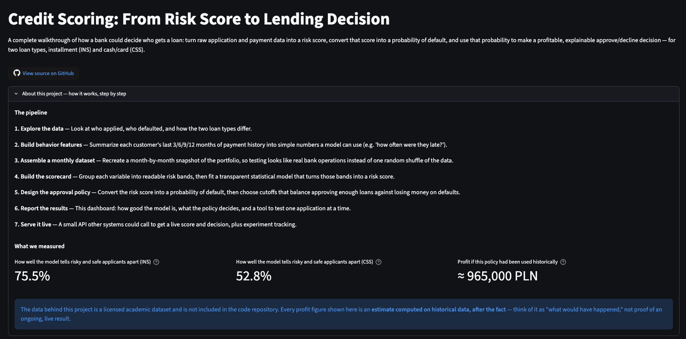
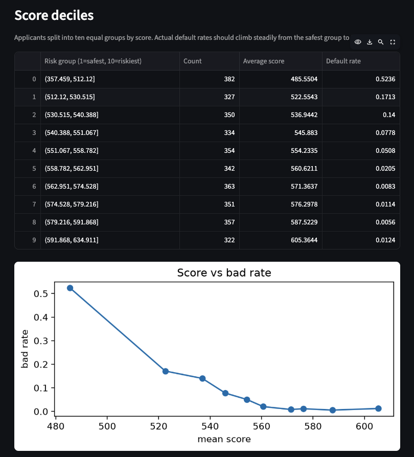
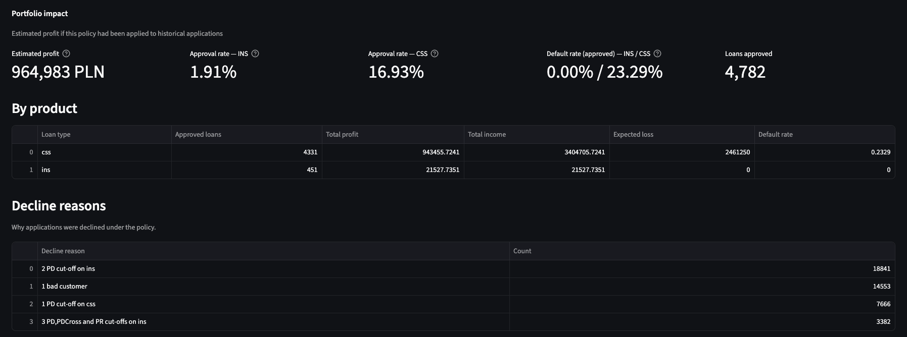
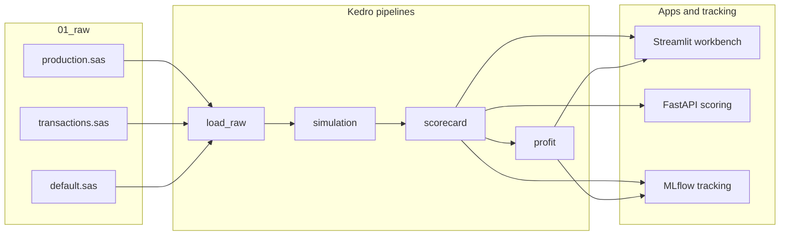
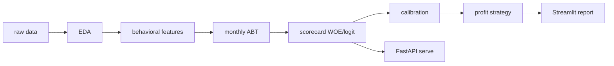
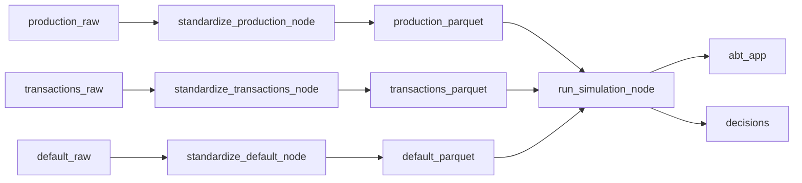
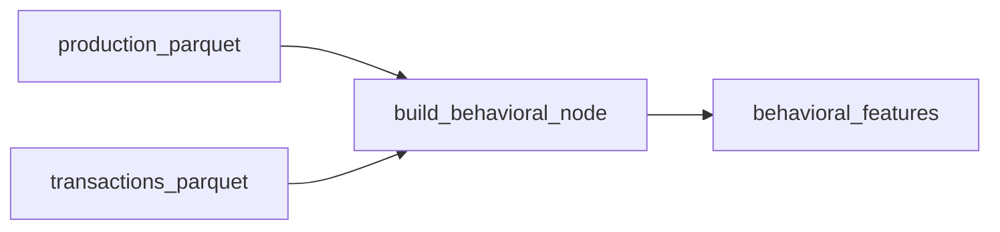
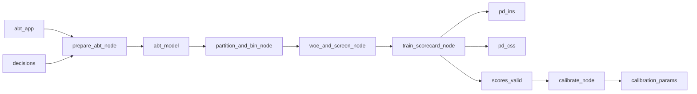
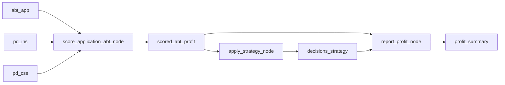

# Credit Scoring: Scorecard to Profit Decision

[](https://github.com/giangphuongtran/scorecard-builder)
[](https://scorecard-builder-giangphuongtran.streamlit.app/)
[](https://www.python.org/)
[](https://kedro.org/)
[](https://fastapi.tiangolo.com/)
[](https://mlflow.org/)

> **Links:** [GitHub repository](https://github.com/giangphuongtran/scorecard-builder) · [Streamlit workbench](https://scorecard-builder-giangphuongtran.streamlit.app/)

This project builds an end-to-end consumer credit workflow: explore raw monthly lending data, engineer behavioral features, assemble a monthly analytical base table, fit application PD scorecards for two product lanes, calibrate score to PD, and turn those PDs into a profit-aware approval policy. The repo is structured as a reproducible Kedro project, with a Streamlit decision report, FastAPI scoring endpoints, and MLflow tracking added around the scorecard workflow.

Banks do not make lending decisions from model rank alone. They need a calibrated default probability, product-specific acceptance rules, and a way to see how approval volume, bad rate, and portfolio profit move together. This project focuses on that full chain: application PD for `ins` and `css`, a constrained cutoff optimizer, and an offline profit evaluation that is explicit about what is measured on historical data versus what still needs live monitoring.

## Streamlit workbench

The **[Streamlit scorecard workbench](https://scorecard-builder-giangphuongtran.streamlit.app/)** is the primary read-only dossier for reviewers: model quality, variable stability, the frozen profit policy, and a single-application officer scoring tool.

**What you can explore:**

- **Model quality** — validation Gini, ROC, score distributions, and variable importance for `ins` and `css`
- **Stability** — temporal bin and Gini diagnostics used as promotion gates
- **Profit policy** — frozen PD cutoffs from [`conf/base/parameters.yml`](conf/base/parameters.yml) and offline as-if profit replay
- **Officer tool** — score one synthetic application and see approve / decline under the policy

**Run locally:**

```bash
uv run python -m streamlit run apps/scorecard_workbench.py
```

The workbench reads bundles from `data/08_reporting/workbench_bundle/` (written by [`notebooks/05_scorecard_profit_tune.ipynb`](notebooks/05_scorecard_profit_tune.ipynb)). Without those artifacts, tabs show setup hints rather than full charts.

| View | Screenshot |
|------|------------|
| Landing page |  |
| Model quality |  |
| Profit policy |  |

See [`docs/images/README.md`](docs/images/README.md) for capture instructions.

## Architecture

End-to-end flow from raw lending tables through Kedro pipelines to reporting and serving apps:



High-level project phases (notebooks + pipelines):



## Project phases

| Stage | What we built | Artifact | Links |
|-------|---------------|----------|-------|
| 1 EDA | Understand applications, defaults, product mix, and bad-rate patterns | `notebooks/01_eda_raw.ipynb` | [notebook](notebooks/01_eda_raw.ipynb) |
| 2 Behavioral | Rolling payment behavior features over 3/6/9/12 months | `behavioral_features` parquet | [pipeline](src/credit_scoring/pipelines/behavioral/), [notebook](notebooks/02_behavioral_features.ipynb) |
| 3 Simulation | Monthly ABT assembly for realistic portfolio-style evaluation | `abt_app`, `decisions` | [pipeline](src/credit_scoring/pipelines/simulation/) |
| 4 Scorecard | WOE binning, variable selection, logistic PD models, frozen scorecards | `pd_ins`, `pd_css`, points tables | [pipeline](src/credit_scoring/pipelines/scorecard/), [ins notebook](notebooks/03_scorecard_ins.ipynb), [css notebook](notebooks/03_scorecard_css.ipynb), [tune notebook](notebooks/05_scorecard_profit_tune.ipynb) |
| 5 Profit | P&L engine, rule-based strategy, offline as-if + closed-loop re-sim | profit summary, strategy decisions | [pipeline](src/credit_scoring/pipelines/profit/), [library](src/credit_scoring/profit/), [notebook](notebooks/04_profit.ipynb) |
| 6 Reporting | Read-only Streamlit dossier: model quality, stability, frozen policy, officer scoring | workbench bundles | [app](apps/scorecard_workbench.py) |
| 7 Serving and tracking | FastAPI scoring API plus MLflow logging | live score endpoint | [API](apps/scorecard_api.py), [MLflow utils](src/credit_scoring/mlflow_utils.py) |

## Kedro pipelines

Registered in [`src/credit_scoring/pipeline_registry.py`](src/credit_scoring/pipeline_registry.py). Mermaid diagrams render on GitHub; PNG exports are optional (see [`docs/images/README.md`](docs/images/README.md)).

### Default pipeline (`kedro run`)

`load_raw` standardizes three SAS inputs to parquet, then `simulation` rebuilds behavioral features internally and writes the monthly ABT.



### Behavioral pipeline (`kedro run --pipeline=behavioral`)

Standalone export of rolling payment features (also embedded inside simulation).



### Scorecard pipeline (`kedro run --pipeline=scorecard`)

Five-node chain: prepare ABT → bin → WOE/IV screen → train PD models → calibrate score to PD.



### Profit pipeline (`kedro run --pipeline=profit`)

Score the application ABT, apply the rule-based strategy, and report offline P&L.



## Results

These figures are measured from frozen artifacts and notebooks in this repo.

- **Application PD discrimination**
  - `ins` validation Gini: **75.5%** from frozen model bundle `pd_ins_v6.pkl`
  - `css` validation Gini: **52.8%** from frozen model bundle `pd_css_v6.pkl`
- **Calibration**
  - score-to-PD uses a saved logistic mapping: `PD = 1 / (1 + exp(-(a + b * score)))`
  - keeps the scorecard interpretable while turning points into a usable probability for policy setting
- **Offline profit**
  - frozen policy total profit: **~965,000 PLN** (`pd_css=0.50`, `pd_ins_high=0.03` on v6 models)
  - Computed on a fixed historical ABT, not from a live portfolio under the new strategy
  

The current selected policy in [`conf/base/parameters.yml`](conf/base/parameters.yml) uses product-level application PD cutoffs and an extra mid-band rule for `ins`. The [Streamlit workbench](https://scorecard-workbench.streamlit.app/) displays this frozen policy; cutoff search remains available in [`credit_scoring.profit.cutoff_explore`](src/credit_scoring/profit/cutoff_explore.py) for offline analysis.

## Design choices

- **WOE + logistic regression** instead of a black-box model: easier to explain, audit, and convert into a scorecard.
- **Time-based validation** rather than random splits: training ends before validation starts, closer to real deployment.
- **Explicit calibration**: raw score maps to PD through a lightweight logistic layer saved as versioned parameters.
- **Constrained cutoff optimization**: maximize profit while respecting minimum acceptance and maximum bad-rate limits.
- **Stability gates before promotion**: temporal diagnostics block unstable drivers from slipping into a deployed scorecard.

## Stack and quick start

**Core stack:** Python, pandas, scikit-learn, statsmodels, Kedro, Streamlit, FastAPI, MLflow.

**Prerequisites:** Python 3.10+, [uv](https://docs.astral.sh/uv/), and local SGH dataset files under `data/01_raw/` (not included in this repository).

**Install and run the default Kedro chain:**

```bash
uv sync
uv run kedro run
```

**Run individual pipelines:**

```bash
uv run kedro run --pipeline=load_raw
uv run kedro run --pipeline=behavioral
uv run kedro run --pipeline=simulation
uv run kedro run --pipeline=scorecard
uv run kedro run --pipeline=profit
```

**Apps and optional extras:**

```bash
# Streamlit decision report (primary UI)
uv run python -m streamlit run apps/scorecard_workbench.py

# FastAPI scoring service
uv run python apps/scorecard_api.py

# Interactive pipeline graph (local)
uv run kedro viz run
```

Optional dependency groups: `uv sync --extra serve` (FastAPI), `uv sync --extra mlops` (MLflow).

## Apps and API

| App | Role | Entry point |
|-----|------|-------------|
| Streamlit workbench | Model dossier, stability, frozen policy, officer scoring | [`apps/scorecard_workbench.py`](apps/scorecard_workbench.py) |
| FastAPI | HTTP scoring endpoint for application PD and decisions | [`apps/scorecard_api.py`](apps/scorecard_api.py) |
| Kedro Viz | Interactive DAG of registered pipelines | `uv run kedro viz run` |

## Repository map

| Path | Contents |
|------|----------|
| [`notebooks/`](notebooks/) | EDA, scorecard development, profit analysis |
| [`src/credit_scoring/pipelines/`](src/credit_scoring/pipelines/) | Kedro pipeline definitions |
| [`src/credit_scoring/scorecard/`](src/credit_scoring/scorecard/) | WoE, binning, fit, calibration, reports |
| [`src/credit_scoring/profit/`](src/credit_scoring/profit/) | P&L engine, rules, cutoff exploration |
| [`apps/`](apps/) | Streamlit workbench and FastAPI service |
| [`conf/base/`](conf/base/) | Kedro catalog, parameters, logging |
| [`docs/images/`](docs/images/) | README screenshots and Kedro-viz exports |

Extended model notes and glossary live in a private `documents/` folder (not published with this repo). For interviews, share those materials separately.

## Data disclaimer

This project uses a licensed academic dataset and does not include raw source files in the repository. The repo is suitable for code review, architecture discussion, and interview walkthroughs, while the original data remains outside version control.