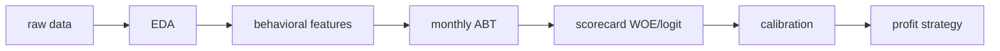

# Credit Scoring: Scorecard to Profit Decision

This project builds an end-to-end consumer credit workflow: explore raw monthly lending data, engineer behavioral features, assemble a monthly analytical base table, fit application PD scorecards for two product lanes, calibrate score to PD, and turn those PDs into a profit-aware approval policy. The repo is structured as a reproducible Kedro project, with a Streamlit decision report, FastAPI scoring endpoints, and MLflow tracking added around the scorecard workflow.

Banks do not make lending decisions from model rank alone. They need a calibrated default probability, product-specific acceptance rules, and a way to see how approval volume, bad rate, and portfolio profit move together. This project focuses on that full chain: application PD for `ins` and `css`, a constrained cutoff optimizer, and an offline profit evaluation that is explicit about what is measured on historical data versus what still needs live monitoring.

## Pipeline Overview



## Project Phases

| Stage | What we built | Artifact |
|-------|---------------|----------|
| 1 EDA | Understand applications, defaults, product mix, and bad-rate patterns | `notebooks/01_eda_raw.ipynb` |
| 2 Behavioral | Rolling payment behavior features over 3/6/9/12 months | `src/credit_scoring/pipelines/behavioral/` |
| 3 Simulation | Monthly ABT assembly for realistic portfolio-style evaluation | `src/credit_scoring/pipelines/simulation/` -> `abt_app` |
| 4 Scorecard | WOE binning, variable selection, logistic PD models, frozen scorecards | `notebooks/03_scorecard_ins.ipynb`, `notebooks/03_scorecard_css.ipynb`, `notebooks/05_scorecard_profit_tune.ipynb`, `src/credit_scoring/pipelines/scorecard/` |
| 5 Profit | P&L engine, rule-based strategy, offline as-if + closed-loop re-sim | `notebooks/04_profit.ipynb`, `src/credit_scoring/pipelines/profit/`, `src/credit_scoring/profit/` |
| 6 Reporting | Read-only Streamlit dossier: model quality, stability, frozen policy, officer scoring | `apps/scorecard_workbench.py` |
| 7 Serving and tracking | FastAPI scoring API plus MLflow logging for scorecard and profit runs | `apps/scorecard_api.py`, `src/credit_scoring/mlflow_utils.py` |

## Results

These figures are measured from frozen artifacts and notebooks in this private repo.

- Measured application PD discrimination:
  - `ins` validation Gini: `75.5%` from frozen model bundle `pd_ins_v6.pkl`
  - `css` validation Gini: `52.8%` from frozen model bundle `pd_css_v6.pkl`
- Measured calibration approach:
  - score-to-PD uses a saved logistic mapping, `PD = 1 / (1 + exp(-(a + b * score)))`
  - this keeps the scorecard interpretable while turning points into a usable probability for policy setting
- Measured profit result:
  - frozen policy as-if total profit: `~965,000 PLN` (`pd_css=0.50`, `pd_ins_high=0.03` on v6 models)
  - course benchmark for comparison: `731,882 PLN`
  - this profit number is explicitly *offline / as-if*: it is computed on a fixed historical ABT, not from a live portfolio under the new strategy

The current selected policy in `conf/base/parameters.yml` uses product-level application PD cutoffs and an extra mid-band rule for `ins`. The Streamlit workbench displays this frozen policy; cutoff search remains available in `credit_scoring.profit.cutoff_explore` for offline analysis.

## Design Choices

- WOE plus logistic regression instead of a black-box model: easier to explain, audit, and convert into a scorecard.
- Validation is time-based rather than random: training ends before validation starts, which is closer to real deployment.
- Calibration is kept explicit and lightweight: the raw score is mapped to PD with a logistic layer saved as versioned parameters.
- Cutoffs are optimized under business constraints: maximize profit while respecting minimum acceptance and maximum bad-rate limits.
- Variable stability is checked before promotion: temporal diagnostics act as a quality gate so unstable drivers do not quietly slip into a deployed scorecard.

## Stack and Quick Start

Core stack: `Python`, `pandas`, `scikit-learn`, `statsmodels`, `Kedro`, `Streamlit`, `FastAPI`, `MLflow`.

Install and run:

```bash
uv sync
uv run kedro run
```

Run individual pieces when needed:

```bash
uv run kedro run --pipeline=scorecard
uv run kedro run --pipeline=profit
uv run python -m streamlit run apps/scorecard_workbench.py
uv run python apps/scorecard_api.py
```

## Repository Guide

- Public summary and project narrative: [`README.md`](README.md)
- Model scope, metrics, and caveats: [`documents/MODEL_CARD.md`](documents/MODEL_CARD.md)
- Deep teaching notes and glossary: [`documents/plan.md`](documents/plan.md)
- Scorecard modules: `src/credit_scoring/scorecard/`
- Profit and strategy modules: `src/credit_scoring/profit/`

## Data Disclaimer

This project uses a licensed academic dataset and does not include raw source files in the repository. The code expects local inputs under `data/01_raw/`, but those files stay private. That means the repo is suitable for code review, architecture discussion, and interview walkthroughs, while the original data remains outside version control.

## Roadmap

Done now:

- application PD scorecards for `ins` and `css`
- behavioral feature pipeline and monthly simulation ABT
- constrained profit cutoff optimization (library; frozen in parameters.yml)
- stability diagnostics and promotion gate inputs
- Streamlit workbench, FastAPI scoring, and MLflow instrumentation

Next:

- lock final monitoring thresholds after more closed-loop review
- add behavioral PD promotion into the same reporting pattern
- harden orchestration with Airflow only after the API and tracking flow are stable

