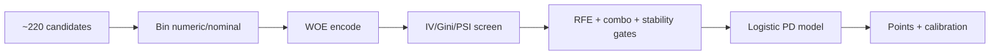
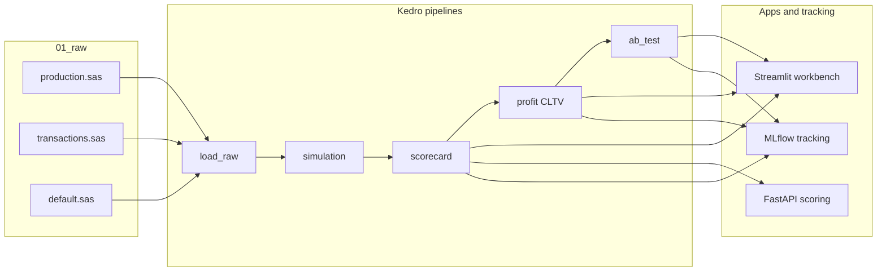
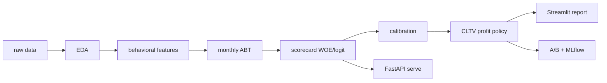
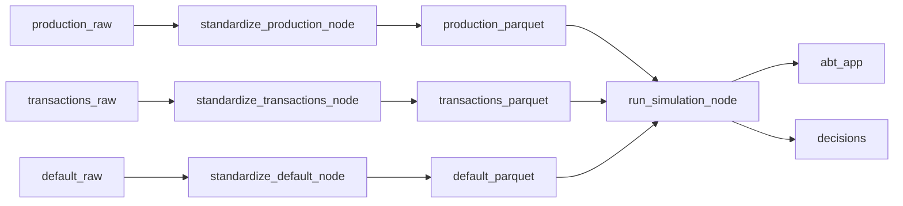
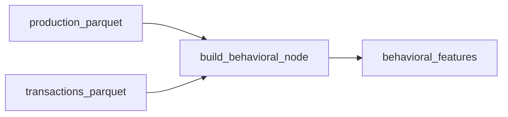
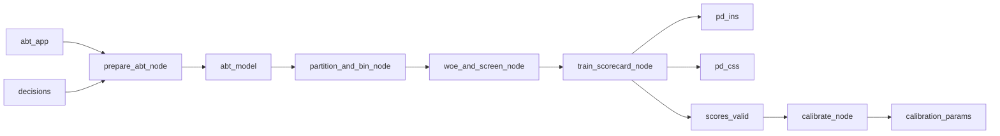
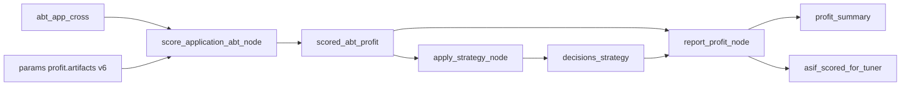

# Credit Scoring: Scorecard to Profit Decision

[GitHub](https://github.com/giangphuongtran/scorecard-builder)
[Streamlit App](https://scorecard-builder-giangphuongtran.streamlit.app/)
[Python](https://www.python.org/)
[Kedro](https://kedro.org/)
[FastAPI](https://fastapi.tiangolo.com/)
[MLflow](https://mlflow.org/)

> **Links:** [GitHub repository](https://github.com/giangphuongtran/scorecard-builder) · [Streamlit workbench](https://scorecard-builder-giangphuongtran.streamlit.app/)

## Executive summary

This project shows how a lender can move from a traditional application scorecard to a profit-aware approval policy.

The core business problem is simple: approve or decline in minutes, but do it in a way that balances volume, losses, and cross-sell upside.

I built four linked models around that decision: installment PD (`ins`), cash/card PD (`css`), cross-sell propensity (`pr`), and cross-product PD (`cross`). On top of them sits a CLTV rule. `CLTV` here means customer lifetime value, but in a practical approval-policy sense rather than a full discounted finance model: keep some borderline installment applicants only when cross-sell upside looks worth it and the other-product risk is still acceptable.

With the frozen `v6` artifacts in this repo, the selected policy produces about **965,000 PLN** on historical replay versus a published benchmark of **731,882 PLN**. That figure is an **offline as-if replay** on a fixed historical application base, not a live result and not a closed-loop re-simulation.

## What problem this project solves

A lender does not only need a model that ranks risk well. It also needs a decision rule that turns scores into approvals, declines, and profit.

That is why this repo is organized around two questions:

1. Can we build interpretable scorecards that separate safer from riskier applicants?
2. Can we turn those scores into a better approval policy than a simple one-cutoff rule?

The focus is on installment lending first, then on whether some borderline applicants are still worth keeping because they may cross-sell into another product without creating too much extra risk.

## What the decision policy does

The policy starts with application PD bands:

- clear low-risk cases can be approved,
- clear high-risk cases can be declined,
- the middle band gets an extra check.

That extra check is the CLTV rule:

- `pr` asks whether the applicant is likely to take the cross-sell product,
- `cross` asks whether that cross-sell customer would still be acceptable risk,
- the applicant is kept only when both pass.

In plain terms, this is a grey-zone approval rule. Instead of treating every borderline installment applicant the same way, the policy keeps only the cases where cross-sell upside looks plausible and the other-product risk stays within bounds.

### How policy changes profit

| Policy move (example)                    | Business effect                                                                               |
| ---------------------------------------- | --------------------------------------------------------------------------------------------- |
| Tighten `pd_ins_high` (e.g. 3% -> 2%)    | Fewer INS approvals; fewer expected defaults; profit usually falls if the band was profitable |
| Loosen `pd_css` (e.g. 50% -> 55%)        | More CSS volume; higher bad rate risk; profit delta depends on CSS economics                  |
| Mid-band CLTV (`pr_min`, `cross_pd_max`) | Keep grey-zone INS only when PR and Cross PD pass                                             |

Interactive sensitivity and the INS mid-band funnel live in the Streamlit **Profit & CLTV policy** tab.

## What results we got

These figures come from frozen artifacts saved in the repo.

| Metric                     | Value              |
| -------------------------- | ------------------ |
| INS validation Gini        | **75.5%**          |
| CSS validation Gini        | **52.8%**          |
| Frozen CLTV policy profit  | **≈ 965,000 PLN**  |
| Published benchmark profit | **731,882 PLN**    |
| Offline delta vs benchmark | **≈ +233,000 PLN** |

More detail:

- `ins` validation Gini: **75.5%** from `pd_ins_v6.pkl`
- `css` validation Gini: **52.8%** from `pd_css_v6.pkl`
- calibration step: `PD = 1 / (1 + exp(-(a + b * score)))`
- selected profit policy: `pd_css=0.50`, `pd_ins_high=0.03`, `pd_ins_low=0.01`, `pr_min=0.028`, `cross_pd_max=0.2724`

The selected policy in `[conf/base/parameters.yml](conf/base/parameters.yml)` is the **CLTV mid-band production** rule. The Streamlit workbench shows it, while cutoff search and trade-off exploration stay in `[src/credit_scoring/profit/](src/credit_scoring/profit/)`.

## Why `965k PLN` is offline replay, not closed-loop re-sim

This distinction matters.

- **As-if / offline replay** means scoring historical applications with frozen models, applying cutoffs, and computing what profit would have been on that fixed frame.
- **Closed-loop re-simulation** means approvals today change the future portfolio, balances, and later outcomes.
- **Live performance** means real production outcomes from an operating portfolio.

The **≈ 965,000 PLN** result belongs to the first bucket only. It is computed on a fixed historical application base using frozen model artifacts and frozen cutoffs.

So the current README claim is:

- useful as evidence that the selected policy beats the published benchmark on offline replay,
- not evidence of live performance,
- not evidence of a full feedback-aware portfolio simulation.

## How the scorecard was built

The scorecard build follows a standard six-step flow:



Final variables, in plain English:

| Product  | n   | Variables (plain English)                                                                        |
| -------- | --- | ------------------------------------------------------------------------------------------------ |
| INS PD   | 7   | children, marital status, job code, age, INS closed-bad count, income, active INS loans        |
| CSS PD   | 5   | CSS loan count, CSS utilization, CSS capacity, all-product loan count, min paid INS installments |
| PR       | 6   | job code, age, income, term, INS history count, all-product capacity                            |
| Cross PD | 6   | age, all-product capacity / loan count, CSS capacity / due util / max due                       |

### Why these choices

- **WOE and logistic regression:** easier to explain and audit when turning the model into a scorecard.
- **Time-based validation:** training ends before validation starts, which is closer to real deployment than random splits.
- **Explicit calibration:** raw scores are mapped to PD through a small logistic layer saved as versioned parameters.
- **CLTV mid-band policy:** borderline installment cases get an extra cross-sell and cross-risk check instead of a single blunt cutoff.
- **Constrained cutoff tuning and offline A/B:** policy variants are compared under acceptance-rate and bad-rate constraints.
- **Stability gates before promotion:** temporal diagnostics help keep unstable drivers out of the frozen scorecard.

## What to open in Streamlit

The **[Streamlit scorecard workbench](https://scorecard-builder-giangphuongtran.streamlit.app/)** is the main read-only review surface for this project.

What you can inspect there:

- **Profit & CLTV policy** for the production mid-band rule, benchmark comparison, sensitivity sliders, and INS funnel
- **Policy experiments (A/B)** for offline champion-versus-challenger cutoffs from `kedro run --pipeline=ab_test`
- **How we built the scorecard** for the six-stage build story from candidates to calibrated points
- **Model quality / Stability** for Gini, ROC, importance, and temporal checks
- **Officer tool** for scoring one application under the frozen policy

Run locally:

```bash
uv run python -m streamlit run apps/scorecard_workbench.py
```

The workbench reads `data/08_reporting/workbench_bundle/`, `asif_scored_for_tuner.parquet`, and optional `ab_test_summary.json`.

| View          | Screenshot                              |
| ------------- | --------------------------------------- |
| Landing page  | Streamlit workbench — landing page      |
| Model quality | Streamlit workbench — model quality tab |
| Profit policy | Streamlit workbench — profit policy tab |

See `[docs/images/README.md](docs/images/README.md)` for capture instructions.

## How to run pipelines and view MLflow

**Core stack:** Python, pandas, scikit-learn, statsmodels, Kedro, Streamlit, FastAPI, MLflow.

**Prerequisites:** Python 3.10+, [uv](https://docs.astral.sh/uv/), and local licensed academic dataset files under `data/01_raw/` (not included in this repository).

Install dependencies and run the default Kedro chain:

```bash
uv sync
uv run kedro run
```

Run individual pipelines:

```bash
uv run kedro run --pipeline=load_raw
uv run kedro run --pipeline=behavioral
uv run kedro run --pipeline=simulation
uv run kedro run --pipeline=scorecard
uv run kedro run --pipeline=profit
uv run kedro run --pipeline=ab_test
```

MLflow notes:

- Logging is enabled by default through `params:mlflow` / `[conf/base/mlflow.yml](conf/base/mlflow.yml)`.
- The default tracking backend is `sqlite:///mlruns.db`.
- MLflow runs appear only when code paths call `maybe_log_run()` or `log_policy_run()`.
- Older notebook runs do not automatically appear in this SQLite backend.
- If MLflow looks empty, first run a logging path such as `uv run kedro run --pipeline=profit` or `uv run kedro run --pipeline=ab_test`.
- Then open the UI from the repo root with:

```bash
uv run mlflow ui --backend-store-uri sqlite:///mlruns.db
```

- In MLflow 3.x, the home page can look empty even when runs exist. Open the experiment directly:
  - [http://127.0.0.1:5000/#/experiments/1](http://127.0.0.1:5000/#/experiments/1) for `credit_scoring`
  - or use the left sidebar: **Experiments** -> **credit_scoring**
- Quick check from the repo root:

```bash
sqlite3 mlruns.db "SELECT name FROM runs ORDER BY start_time DESC LIMIT 5;"
```

Disable logging with `MLFLOW_ENABLE=0`.

Apps:

```bash
# Streamlit decision report (primary UI)
uv run python -m streamlit run apps/scorecard_workbench.py

# FastAPI scoring service
uv run python apps/scorecard_api.py

# Interactive pipeline graph (local)
uv run kedro viz run
```

Optional dependency groups: `uv sync --extra serve` for FastAPI and `uv sync --extra mlops` for MLflow.

## Architecture

End-to-end flow from raw lending tables through Kedro pipelines to reporting and serving apps:



High-level project phases (notebooks + pipelines):



## Project phases

| Stage                  | What we built                                                                 | Artifact                       | Links                                                                                                                                                                                                              |
| ---------------------- | ----------------------------------------------------------------------------- | ------------------------------ | ------------------------------------------------------------------------------------------------------------------------------------------------------------------------------------------------------------------ |
| 1 EDA                  | Understand applications, defaults, product mix, and bad-rate patterns         | `notebooks/01_eda_raw.ipynb`   | [notebook](notebooks/01_eda_raw.ipynb)                                                                                                                                                                             |
| 2 Behavioral           | Rolling payment behavior features over 3/6/9/12 months                        | `behavioral_features` parquet  | [pipeline](src/credit_scoring/pipelines/behavioral/), [notebook](notebooks/02_behavioral_features.ipynb)                                                                                                        |
| 3 Simulation           | Monthly ABT assembly for realistic portfolio-style evaluation                  | `abt_app`, `decisions`         | [pipeline](src/credit_scoring/pipelines/simulation/)                                                                                                                                                               |
| 4 Scorecard            | WOE binning, variable selection, logistic PD models, frozen `v6` scorecards   | `pd_*_v6`, points, calibration | [pipeline](src/credit_scoring/pipelines/scorecard/), [ins notebook](notebooks/03_scorecard_ins.ipynb), [css notebook](notebooks/03_scorecard_css.ipynb), [tune notebook](notebooks/05_scorecard_profit_tune.ipynb) |
| 5 Profit               | P&L engine plus the CLTV mid-band policy on offline as-if replay              | profit summary, as-if frame    | [pipeline](src/credit_scoring/pipelines/profit/), [library](src/credit_scoring/profit/)                                                                                                                          |
| 5b A/B                 | Offline champion versus challenger cutoff comparison                           | `ab_test_summary.json`         | [pipeline](src/credit_scoring/pipelines/ab_test/)                                                                                                                                                                  |
| 6 Reporting            | Streamlit dossier for CLTV policy, A/B, build story, model quality, officer tool | workbench bundles           | [app](apps/scorecard_workbench.py)                                                                                                                                                                                 |
| 7 Serving and tracking | FastAPI scoring API plus MLflow logging                                        | live score endpoint            | [API](apps/scorecard_api.py), [MLflow utils](src/credit_scoring/mlflow_utils.py)                                                                                                                                  |

## Kedro pipelines

Registered in `[src/credit_scoring/pipeline_registry.py](src/credit_scoring/pipeline_registry.py)`. Mermaid diagrams render on GitHub; PNG exports are optional (see `[docs/images/README.md](docs/images/README.md)`).

### Default pipeline (`kedro run`)

`load_raw` standardizes three SAS inputs to parquet, then `simulation` rebuilds behavioral features internally and writes the monthly ABT.



### Behavioral pipeline (`kedro run --pipeline=behavioral`)

Standalone export of rolling payment features, also embedded inside simulation.



### Scorecard pipeline (`kedro run --pipeline=scorecard`)

Five-node chain: prepare ABT -> bin -> WOE/IV screen -> train PD models -> calibrate score to PD.



### Profit pipeline (`kedro run --pipeline=profit`)

Score the labeled application ABT with frozen `v6` PD, PR, and Cross artifacts, apply the CLTV mid-band strategy, report offline P&L, and refresh the as-if frame for Streamlit.



### A/B pipeline (`kedro run --pipeline=ab_test`)

Offline champion-versus-challenger comparison on the frozen as-if scored frame, producing `ab_test_summary.json` and MLflow runs.

## Apps and API

| App                 | Role                                                          | Entry point                                                  |
| ------------------- | ------------------------------------------------------------- | ------------------------------------------------------------ |
| Streamlit workbench | CLTV policy, A/B, build story, model dossier, officer scoring | `[apps/scorecard_workbench.py](apps/scorecard_workbench.py)` |
| FastAPI             | HTTP scoring endpoint for application PD and decisions        | `[apps/scorecard_api.py](apps/scorecard_api.py)`             |
| Kedro Viz           | Interactive DAG of registered pipelines                       | `uv run kedro viz run`                                       |

## Repository map

| Path                                                             | Contents                                          |
| ---------------------------------------------------------------- | ------------------------------------------------- |
| `[notebooks/](notebooks/)`                                       | EDA, scorecard development, profit analysis       |
| `[src/credit_scoring/pipelines/](src/credit_scoring/pipelines/)` | Kedro pipeline definitions                        |
| `[src/credit_scoring/scorecard/](src/credit_scoring/scorecard/)` | WoE, binning, fit, calibration, reports           |
| `[src/credit_scoring/profit/](src/credit_scoring/profit/)`       | P&L engine, rules, cutoff exploration, trade-offs |
| `[apps/](apps/)`                                                 | Streamlit workbench and FastAPI service           |
| `[conf/base/](conf/base/)`                                       | Kedro catalog, parameters, MLflow, logging        |
| `[docs/images/](docs/images/)`                                   | README screenshots and Kedro-viz exports          |

Extended model notes and glossary live in a private `documents/` folder and are not published with this repo.

## Data disclaimer

This project uses a licensed academic dataset and does not include raw source files in the repository. The repo is suitable for code review, architecture discussion, and interview walkthroughs, while the original data remains outside version control.