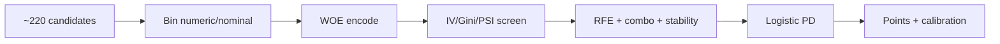
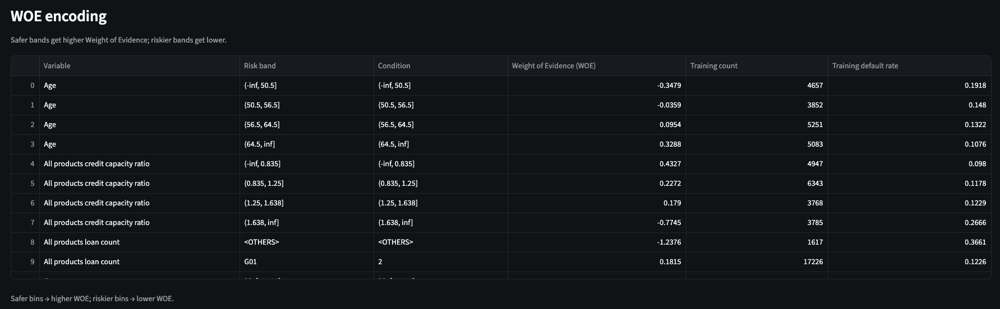

# Credit Scoring: Scorecard to Profit Decision

**Links:** [GitHub](https://github.com/giangphuongtran/scorecard-builder) · [Streamlit workbench](https://scorecard-builder-giangphuongtran.streamlit.app/)

## Project Overview

- Built application **PD scorecards** for installment (`ins`) and cash/card (`css`), plus cross-sell propensity (`pr`) and cross-product PD (`cross`)
- Defined a **decision strategy** with PD cutoffs (**Accept / Refer / Reject**) and a **CLTV** rule on the refer band
- Offline P&L **≈ 965,000 PLN** vs published benchmark **731,882 PLN** (~ 31% uplift)
- INS validation Gini **75.5%**, CSS **52.8%** (frozen `v6` artifacts)
- Kedro pipelines, Streamlit workbench, FastAPI scoring, and MLflow tracking


## Motivation

Lenders need to **accept or reject** applications quickly at scale. The hard part is the trade-off between **acceptance rate**, **bad rate** / expected loss, and later **cross-sell** value on other products.

This project builds explainable application scorecards first, then a **decision strategy**: clear accept/reject by PD cutoff, and in the **refer band** approve only when cross-sell propensity and cross-product PD pass their cutoffs.

## Why this maps to a Risk Engine

The pipeline mirrors how a bank's credit risk infrastructure works: raw application/behavioral data is transformed into an analytical base table (a **data mart**) that feeds a **PD engine**. 
Cutoffs, IV/Gini/PSI thresholds, and calibration parameters are versioned in one config file, the same pattern used to keep a regulatory-compliant engine auditable and easy to update when policy changes. The Accept/Refer/Reject decision logic is a simplified analogue of rule-based engines (e.g. definition-of-default logic) that compute risk parameters feeding capital and provisioning calculations.

## Stack

**Python 3.10+** · pandas · scikit-learn · statsmodels · Kedro · Streamlit · FastAPI · MLflow

```bash
uv sync
uv run kedro run
```

Raw licensed academic data under `data/01_raw/` is not included in this repository.

## How I built the scorecard

Six steps from ~220 candidate variables to calibrated points:




For each applicant, application and behavioral fields (employment, income, loan history, capacity, etc.) are binned: a decision tree for numeric variables; for nominal variables, rare levels below a share threshold (default **5%**) are pooled into `<OTHERS>`, then groups are merged by risk. From those bins I build **WOE** tables, then pre-screen with **IV**, **Gini**, and **PSI**. Survivors go through **RFE** (logistic) shortlisting, combinatorial model search, and stability checks. Thresholds live in one place (`conf/base/parameters.yml`). The winning set fits a logistic **PD** model; scores are scaled to points and calibrated to PD.

```yaml
# conf/base/parameters.yml (scorecard / model screens)
rare_threshold: 0.05
iv_min: 0.02
gini_min: 0.05
psi_max: 0.25
```

```python
# src/credit_scoring/scorecard/binning.py — rare nominal levels → <OTHERS>
freq = clean["_cat_norm"].value_counts(normalize=True)
rare_cats = set(freq[freq < rare_threshold].index)
# ... remaining cats sorted by event rate, then merged into risk groups
```

```text
Calibration:  PD = 1 / (1 + exp(-(a + b * score)))
```

Why this stack:

- **WOE + logistic regression** — standard for audit-friendly scorecards
- **Time-based train/valid split** — closer to deployment than a random split
- **Explicit calibration** — map score to PD with versioned parameters
- **Stability / PSI gates** — keep unstable drivers out of the frozen scorecard



## Selected variables


| Product  | n   | Variables                                                                                        |
| -------- | --- | ------------------------------------------------------------------------------------------------ |
| INS PD   | 7   | children, marital status, job code, age, INS closed-bad count, income, active INS loans          |
| CSS PD   | 5   | CSS loan count, CSS utilization, CSS capacity, all-product loan count, min paid INS installments |
| PR       | 6   | job code, age, income, term, INS history count, all-product capacity                             |
| Cross PD | 6   | age, all-product capacity / loan count, CSS capacity / due util / max due                        |


## Decision strategy (CLTV)

PD cutoffs define three bands:

1. **Accept** — low PD
2. **Reject** — high PD
3. **Refer** — middle PD band; approval also needs a **CLTV** check

On the refer band:

- `pr` — is the applicant likely to take the cross-sell product?
- `cross` — would that cross-sell customer stay within risk limits?
- approve only when **both** pass their cutoffs

Selected cutoffs (also in `conf/base/parameters.yml`):

```yaml
profit:
  cutoffs:
    pd_css: 0.50
    pd_ins_high: 0.03   # reject above this INS PD
    pd_ins_low: 0.01    # accept below this INS PD
    pr_min: 0.028
    cross_pd_max: 0.2724
```


| Strategy move (example)                    | Business effect                                                                             |
| ------------------------------------------ | ------------------------------------------------------------------------------------------- |
| Tighten `pd_ins_high` (3% → 2%)            | Fewer INS approvals; lower expected defaults; P&L usually falls if that band was profitable |
| Loosen `pd_css` (50% → 55%)                | More CSS volume; higher bad-rate risk; P&L depends on CSS economics                         |
| Refer-band CLTV (`pr_min`, `cross_pd_max`) | Approve refer-band INS only when cross-sell propensity and cross-product PD pass            |


## Results

Figures from frozen artifacts in the repo (`pd_ins_v6.pkl`, `pd_css_v6.pkl`, profit pipeline output):


| Metric                        | Value              |
| ----------------------------- | ------------------ |
| INS validation Gini           | **75.5%**          |
| CSS validation Gini           | **52.8%**          |
| Selected strategy offline P&L | **≈ 965,000 PLN**  |
| Published benchmark           | **731,882 PLN**    |
| Delta vs benchmark            | **≈ +233,000 PLN** |


These are **offline / historical backtest** results, not live production impact.


Champion vs challenger cutoffs can be compared with `uv run kedro run --pipeline=ab_test` (summary in `ab_test_summary.json`, logged to MLflow).

## Streamlit workbench

Main review UI: **[Streamlit scorecard workbench](https://scorecard-builder-giangphuongtran.streamlit.app/)**

What you can open there:

- **Profit & CLTV** — selected strategy, benchmark comparison, cutoff sensitivity
- **Policy experiments (A/B)** — champion vs challenger from the `ab_test` pipeline
- **How we built the scorecard** — candidates → bins → WOE → model → points
- **Model quality / Stability** — Gini, ROC, importance, temporal checks
- **Officer tool** — score one application under the frozen strategy

```bash
uv run python -m streamlit run apps/scorecard_workbench.py
```


## How to run

```bash
uv sync

# Default: load_raw → simulation (monthly ABT)
uv run kedro run

# Other pipelines
uv run kedro run --pipeline=behavioral
uv run kedro run --pipeline=scorecard
uv run kedro run --pipeline=profit
uv run kedro run --pipeline=ab_test

# Apps
uv run python -m streamlit run apps/scorecard_workbench.py
uv sync --extra serve && uv run python apps/scorecard_api.py

# Tests / optional extras
uv sync --extra dev && uv run pytest
uv sync --extra mlops   # MLflow tooling
uv run kedro viz run
```


## Repo map


| Path                                                             | Contents                                    |
| ---------------------------------------------------------------- | ------------------------------------------- |
| `[notebooks/](notebooks/)`                                       | EDA, scorecard development, profit analysis |
| `[src/credit_scoring/pipelines/](src/credit_scoring/pipelines/)` | Kedro pipelines                             |
| `[src/credit_scoring/scorecard/](src/credit_scoring/scorecard/)` | Binning, WOE, selection, fit, calibration   |
| `[src/credit_scoring/profit/](src/credit_scoring/profit/)`       | P&L engine, cutoffs, trade-offs             |
| `[apps/](apps/)`                                                 | Streamlit workbench and FastAPI service     |
| `[conf/base/](conf/base/)`                                       | Catalog, parameters, MLflow                 |
| `[docs/images/](docs/images/)`                                   | README screenshots (add your captures here) |


Extended notes live in a private `documents/` folder and are not published with this repo.

## Data note

This project uses a licensed academic dataset. Raw source files are not in the repository. The repo is for code review, architecture discussion, and interview walkthroughs.